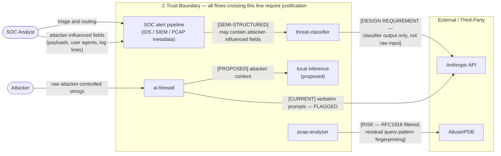

# Gate 2 — Trust Boundary Mapping
**Project:** threat-classifier  
**Status:** Complete — pending repo creation  
**Date:** 2026-05-23  
**Scope:** All data flows that cross a trust boundary into or out of the threat-classifier system, including pre-existing violations in upstream signal sources.

---

## Data Flow Diagram

---

## Flow Justifications

### Flow 1 — SOC alert pipeline → threat-classifier `[SEMI-STRUCTURED]`

The SOC alert pipeline aggregates output from IDS/SIEM systems and PCAP metadata before handing off to threat-classifier for triage. This input is semi-structured: it carries machine-generated fields (timestamps, severity scores, source IPs, protocol metadata) but also attacker-influenced fields such as HTTP user-agent strings, DNS query names, IDS signature match content, and decoded payload fragments. The pipeline does not sanitise attacker-controlled strings — it preserves them as evidence.

**Implication for threat-classifier:** TC must treat all pipeline input as untrusted. Fields that originate from attacker-controlled content must not be forwarded to external APIs or interpolated into prompts without explicit sanitisation. TC's classifier model receives the full semi-structured record; only sanitised metadata or classifier output (scores, labels, confidence values) may cross the outbound boundary to Anthropic API.

---

### Flow 2 — threat-classifier → Anthropic API `[DESIGN REQUIREMENT — classifier output only, not raw input]`

**threat-classifier does not yet exist.** This boundary is a design requirement enforced before the first line of code is written, not a post-hoc audit finding.

The Anthropic API boundary is acceptable on one strict condition: threat-classifier must serialise only classifier output — confidence scores, predicted labels, severity tiers, numerical features — and must never forward raw alert text, attacker-supplied strings, verbatim prompt content, or decoded payloads. This requirement is non-negotiable and must be enforced at the API call site as a code-level constraint, not a documentation note.

Rationale: Anthropic's inference infrastructure is external and outside the operator's data perimeter. Forwarding attacker-controlled strings would constitute a data exfiltration path and could expose sensitive SOC investigation context to a third-party provider. Classifier output (scores and labels) carries no attacker-controlled content and presents no material confidentiality risk.

**Enforcement:** The PR that introduces the Anthropic API call must include a code review checkpoint confirming that the `content`/`messages` payload contains only classifier output. This checkpoint is a Gate 3 entry condition.

---

### Flow 3 — ai-firewall → Anthropic API `[CURRENT — FLAGGED, pre-existing violation]`

`ai-firewall/detector.py:api_scan()` currently passes verbatim attacker-supplied prompts directly to the Anthropic API. This violation is pre-existing and documented in the Gate 1 checklist. It exists before threat-classifier is involved and is not caused by this project.

The concern for threat-classifier is downstream: **ai-firewall output cannot be treated as sanitised.** If threat-classifier ingests ai-firewall signals, it receives data that has already been processed against verbatim attacker prompts and may itself carry attacker-influenced content in detection metadata or log fields. TC must apply the same untrusted-input posture to ai-firewall output as it applies to all other signal sources.

The current flow (ai-firewall → Anthropic API directly) is flagged and blocked from shipping as-is. The architectural fix is Flow 4.

---

### Flow 4 — ai-firewall → local inference `[PROPOSED — architectural fix]`

The proposed remediation for Flow 3 routes attacker-controlled content to a local inference model (Mistral 7B or equivalent) rather than the Anthropic API. Local inference runs within the trust boundary; no attacker-controlled strings leave the operator's environment.

This is an architectural decision made at Gate 2. The boundary split is:

| Content type | Route |
|---|---|
| Attacker-controlled strings, verbatim prompts, decoded payloads | Local inference (within boundary) |
| Classifier output — scores, labels, confidence values | Anthropic API (acceptable) |

Local inference introduces an adversarial ML evasion surface: an attacker who can enumerate the local model's decision boundary may craft inputs that evade classification. This risk is acknowledged and **explicitly deferred to Gate 3**, where adversarial ML robustness will be assessed. Deferral rationale: Gate 2 scope is trust boundary mapping; adversarial ML evasion is a model-layer threat that requires a separate analysis against a concrete model selection and feature set, neither of which exists at this stage.

---

### Flow 5 — pcap-analyser → AbuseIPDB `[RISK — accepted]`

pcap-analyser submits IPs from live packet captures to AbuseIPDB for reputation scoring. Private and reserved ranges are filtered prior to any external query via `_is_private_ip()`, which uses Python's `ipaddress.is_private` — RFC1918, loopback, and link-local addresses are excluded at `threat_intel.py:21` and return early with `skip: True`. Only routable public IPs reach AbuseIPDB.

Risk acceptance rationale: AbuseIPDB operates as a community threat-sharing platform; IP reputation queries are not commercially sensitive, and enrichment against known-malicious infrastructure is standard SOC practice with an established risk profile.

Residual risk: query-pattern fingerprinting — an observer with AbuseIPDB access could infer which public IPs your network is investigating. Mitigation path: batch queries and introduce timing jitter to reduce fingerprinting surface. Deferred pending operational volume data.

---

## Deferred Items

| Item | Deferred to | Rationale |
|---|---|---|
| Adversarial ML evasion (local inference model) | Gate 3 | Requires concrete model selection and feature set — neither exists at Gate 2 |
| `honeypot.db` indefinite retention | Gate 3 pre-condition | No purge policy means raw attacker prompts accumulate indefinitely; needs a retention window decision before TC ingests honeypot signals at any volume |
| llm-redteam real payload fixtures in TC tests | Gate 4 (pre-Phase 4) | Decision needed before test fixtures are written; payload handling policy not yet set |
| AbuseIPDB query batching / timing jitter | Post-MVP | Deferred pending operational volume data to size batch windows correctly |

---

## Pre-Existing Violations (upstream — not caused by this project)

Documented here for completeness. These violations exist in signal source repos and are inputs to TC's trust model, not outputs of it.

| Source | Violation | Status |
|---|---|---|
| `ai-firewall/detector.py:api_scan()` | Verbatim attacker prompts sent to Anthropic API | Pre-existing, flagged in Gate 1 — see Flow 3 |
| `pcap-analyser/threat_intel.py:check_ip_reputation()` | Real public IPs sent to AbuseIPDB | Pre-existing, risk-accepted in Flow 5 |
| `llm-honeypot/classifier.py:17` | `sys.path.insert(0, '../ai-firewall')` relative path coupling | Pre-existing, silent wrong-detector risk on layout change |
| `honeypot.db` | Indefinite retention of raw attacker prompts, no purge policy | Pre-existing — promoted to deferred items, Gate 3 pre-condition |

---

## Sign-off Conditions

Gate 2 is complete when:

- [x] All five trust boundary flows have documented justifications
- [x] AbuseIPDB RFC1918 filter confirmed via code read (`threat_intel.py:21`)
- [x] TC → Anthropic API boundary established as design requirement (repo not yet created)
- [x] ai-firewall → Anthropic API flagged flow correctly attributed (pre-existing, upstream)
- [x] Adversarial ML evasion surface acknowledged and formally deferred to Gate 3
- [x] `honeypot.db` retention gap promoted to Gate 3 pre-condition
- [x] Pre-existing upstream violations documented and acknowledged as untrusted inputs
- [ ] Gate 2 doc merged to threat-classifier repo (pending repo creation)
